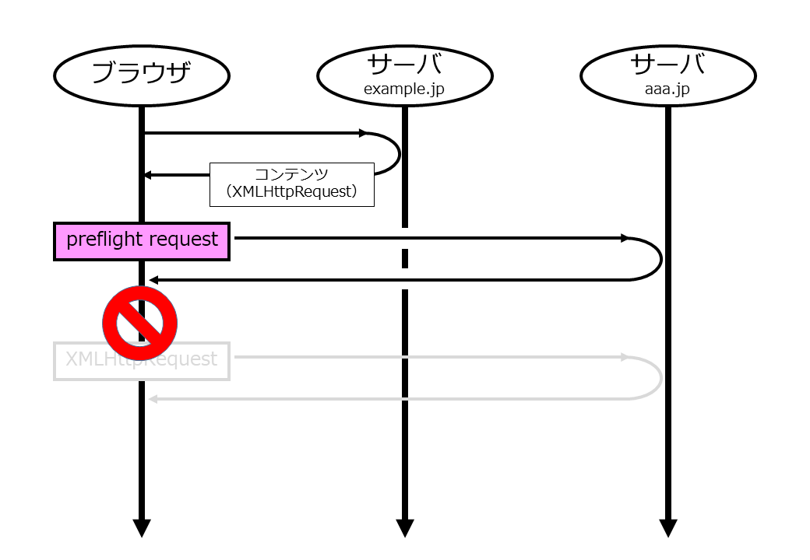

# gocors --- CORS (Cross-Origin Resource Sharing) の GoLang によるサンプル

あるコンテンツが "XMLHttpRequest" を用いて WebAPI に対して JSON データを入出力としたアクセスすることを考える。

GoLang では次の handlerAPI 関数のような実装を検討するはずだ。

```
func main() {
	http.HandleFunc("aaa.jp/api", handlerAPI)
	http.ListenAndServe(port, nil)
}

func handlerAPI(w http.ResponseWriter, r *http.Request) {
	// POSTメソッド意外の場合は 405 を返す
	if r.Method != http.MethodPost {
		w.WriteHeader(http.StatusMethodNotAllowed)
		return
	}

	// 返信データの用意
	retData := NewRetData()

	// JSON形式のパラメータを取得
	param, err := getParamFromJSON(r)

	// パラメータの取得に成功したとき
	if err == nil {
		// calc の計算結果を返信データに設定
		retData.Status = "OK"
		retData.Value = calc(param.X, param.Y)
	}

	w.Header().Set("Content-Type", "application/json")

	// JSON 形式でクライアントに返信
	fmt.Fprintf(w, `%s`, retData.JSONString())
}
```

この実装は "Same-Origin Policy" の条件を前提としている。


この WebAPI を別のオリジンのコンテンツからも使う場合には、"Same-Origin Policy" を満たせずブラウザによりブロックされてしまう。

その際に例えば Chrome では次のようなメッセージがコンソールに表示される。

```
Access to XMLHttpRequest at 'http://aaa.jp:8080/api' from origin 'http://example.jp:8080' has been blocked by CORS policy: Response to preflight request doesn't pass access control check: No 'Access-Control-Allow-Origin' header is present on the requested resource.
```

オリジンが 'example.jp' でここから XMLHttpRequest で 'aaa.jp' の WebAPI にアクセスする前に、"preflight request" が要求される。しかしそのレスポンスが "CORS policy" を満たさずブロックされてしまう。



クロスオリジンな状況でも WebAPI を提供できるようにするには、ブラウザが要求する "preflight request" に対してオリジンを許可するレスポンスを返す必要がある。

必要なレスポンスヘッダを以下に示す。

|レスポンスヘッダ|概要|
|:--|:--|
|Access-Control-Allow-Origin|アクセスを許容するオリジン|
|Access-Control-Allow-Methods|アクセスを許容するメソッド群|
|Access-Control-Allow-Headers|アクセスを許容するヘッダ群|

以下にレスポンスヘッダの例を示す。

```
Access-Control-Allow-Origin: http://example.jp:8080
Access-Control-Allow-Methods: POST, OPTIONS
Access-Control-Allow-Headers: Content-Type
```

"Access-Control-Allow-Methods" で WebAPI 用の "POST" メソッドと "preflight request" 用の "OPTIONS" メソッドを追加している。また、WebAPI の入力データのコンテンツタイプ用に "Access-Control-Allow-Headers" で "Content-Type" を指定する。

通常、同一オリジンで使用する WebAPI ならば上記のように "POST" メソッドのみ実装すればよいが、クロスオリジンで使用するには "preflight request" に応答できなければならない。以下に "preflight request" への対応するため先の実装を修正する。

```
func main() {
	// http.HandleFunc("aaa.jp/api", handlerAPI)
	http.HandleFunc("aaa.jp/api", handlerAPIWithCORS)
	http.ListenAndServe(port, nil)
}

func handlerAPI(w http.ResponseWriter, r *http.Request) {
    // 省略
}

func handlerAPIWithCORS(w http.ResponseWriter, r *http.Request) {
	// Origin ヘッダのチェック
	if !IsAllowableOrigin(r) {
		// Origin を許容できない場合は 403 を返す
		w.WriteHeader(http.StatusForbidden)
		return
	}

	// OPTIONS メソッドのときは preflight request を処理して終了。
	if r.Method == http.MethodOptions {
		processPreFlightRequest(w, r)
		return
	}

	// handlerAPI のレスポンスにオリジンを許容するヘッダを追加する。
	w.Header().Set("Access-Control-Allow-Origin", r.Header.Get("Origin"))

	// API 処理の呼び出し
	handlerAPI(w, r)
}

func processPreFlightRequest(w http.ResponseWriter, r *http.Request) {
	// クライアントからの Origin を許容する
	w.Header().Set("Access-Control-Allow-Origin", r.Header.Get("Origin"))
	w.Header().Set("Access-Control-Allow-Methods", "POST, OPTIONS")
	w.Header().Set("Access-Control-Allow-Headers", "Content-Type")
}

```

"handlerAPIWithCORS" 関数は "handlerAPI" 関数をラップする。重要なポイントは以下の二点である。

* "OPTIONS" メソッドの場合 "processPreFlightRequest" 関数により、"preflight request" に対してオリジンを許可するレスポンスを返す。

* "handlerAPI" 関数のレスポンスにオリジンを許可するヘッダを追加する。


